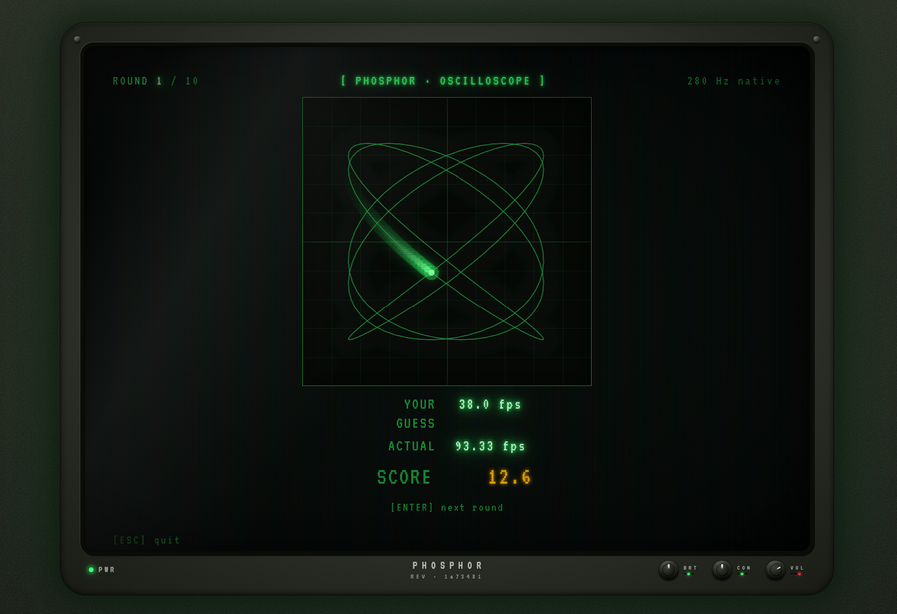

```
    █████ █   █ █████ █████ █████ █   █ █████ █████
    █   █ █   █ █   █ █     █   █ █   █ █   █ █   █
    █████ █████ █   █ █████ █████ █████ █   █ █████
    █     █   █ █   █     █ █     █   █ █   █ █ █
    █     █   █ █████ █████ █     █   █ █████ █   █

              ─── a frame-rate perception test ───
```

<p align="center">
  
</p>

```
$ man phosphor

NAME
       phosphor(1) — a frame-rate perception test

SYNOPSIS
       a small green-phosphor CRT, a dim room, and one question:
       how many frames per second was that?
```

## ▌ TRANSMISSION

A clip plays at a hidden frame rate. You guess the rate.
The CRT scores the gap.

There is no leaderboard. The CRT remembers your last fifty runs
and that is enough.

## ▌ CONTROLS

```
┌─────────────────────────────────────────────┐
│   ↑ ↓     navigate                          │
│   ↵       select                            │
│   ESC     back                              │
│   M       mute the hum                      │
│   S       (results) copy a share card       │
└─────────────────────────────────────────────┘
```

## ▌ CALIBRATION

First boot, the menu will nag you. Calibration is one screen —
it measures your monitor's refresh ceiling and remembers it.
The game uses that ceiling as the upper bound on what it'll
throw at you.

Different display? Calibrate again.

## ▌ DIFFICULTY

```
┌─────────────────────────────────────────────┐
│   EASY      5 rounds    ·  gentler curve    │
│   NORMAL   10 rounds    ·                   │
│   HARD     15 rounds    ·  meaner curve     │
└─────────────────────────────────────────────┘
```

Per-difficulty bests live in `MENU → HISTORY`.

## ▌ SHARE CARD

Press `S` on the results screen — it goes straight to your clipboard.

```
PHOSPHOR · HARD · 87.3/100
144 Hz native

🟢🟢🟡🟢🟢🟡🟡🟢🟢🟢🟢🟢🟡🟢🟢

 #   ACTUAL  GUESS  SCORE
01     48.0   45.0   91.2
 …
```

## ▌ INTERNALS

Svelte 5 (runes) · TypeScript · Vite · pnpm.
No router, no backend, no accounts. Whatever needs to be
remembered lives in `localStorage`.

```
$ pnpm dev         ── run it
$ pnpm build       ── bundle
$ pnpm checklist   ── lint, format, typecheck
```

## ▌ AESTHETIC

The CRT is real-ish on purpose. A slightly recessed tube.
A plastic gasket ring. A phosphor halo bleeding onto the
wall behind it. A degauss wobble whenever a screen changes.
A hum bar that occasionally sweeps the menu.

None of it is necessary. All of it is the point.

## ▌ SUPPORT

```
$ man phosphor | tail
```

phosphor will always run free in your browser. If it earned a
spot on your machine, you can keep the tube warm:

```
https://ko-fi.com/zerbyy
```

```
$ exit
─── end of transmission ───
```
